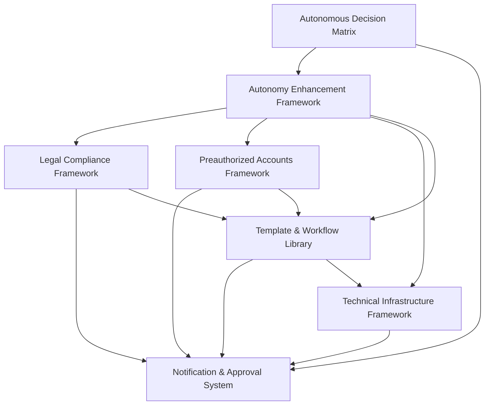

# Autonomy Frameworks for Abacus.ai Agents

## Overview

This collection of frameworks provides a comprehensive system for implementing autonomous agents on the Abacus.ai platform. These frameworks are designed to work together to enable AI agents to operate with maximum autonomy while maintaining appropriate human oversight, security, and compliance.

## Framework Components

The autonomy system consists of seven interconnected frameworks:

1. **Autonomous Decision Matrix** - Defines when agents can act independently vs. when human approval is required
2. **Autonomy Enhancement Framework** - Outlines tools, resources, and protocols to maximize autonomous capabilities
3. **Legal Compliance Framework** - Establishes templates and protocols for handling regulatory compliance
4. **Notification & Approval System** - Creates a structured system for agent-human communication
5. **Preauthorized Accounts Framework** - Manages financial accounts and payment methods with defined limits
6. **Technical Infrastructure Framework** - Provides modular, containerized infrastructure for autonomous operations
7. **Template & Workflow Library** - Offers reusable templates and workflows for consistent execution

## How the Frameworks Interconnect

### Core Decision-Making Layer
The **Autonomous Decision Matrix** serves as the central decision-making framework, defining clear thresholds for when agents can act independently and when they need human input. This matrix connects directly to the notification system for approvals and to the enhancement framework for implementation.

### Capability Enhancement Layer
The **Autonomy Enhancement Framework** expands on the decision matrix by providing specific tools, resources, and protocols that enable autonomous operation. It connects to all other frameworks, serving as the bridge between decision-making and implementation.

### Implementation Layer
The remaining frameworks provide specialized implementation capabilities:
- **Legal Compliance Framework** ensures all autonomous actions remain compliant with regulations
- **Preauthorized Accounts Framework** enables financial operations within defined limits
- **Technical Infrastructure Framework** provides the technical foundation for autonomous execution
- **Template & Workflow Library** offers standardized processes for consistent implementation

### Communication Layer
The **Notification & Approval System** serves as the communication backbone, connecting all frameworks to human oversight when needed. It ensures appropriate escalation, approval workflows, and documentation of decisions.

## Implementation for Abacus.ai Agents

### Agent Configuration

When implementing these frameworks in Abacus.ai agents:

1. **Decision Boundaries**: Configure agent decision thresholds based on the Autonomous Decision Matrix
2. **Communication Protocols**: Implement notification and approval workflows for human oversight
3. **Resource Access**: Set up preauthorized access to necessary tools and platforms
4. **Template Integration**: Load relevant templates and workflows for the agent's specific functions
5. **Compliance Rules**: Configure compliance parameters based on operational requirements

### Recommended Implementation Sequence

1. Start with the **Technical Infrastructure Framework** to establish the foundation
2. Implement the **Template & Workflow Library** for standardized operations
3. Configure the **Notification & Approval System** for human oversight
4. Set up the **Preauthorized Accounts Framework** for financial operations
5. Implement the **Legal Compliance Framework** for regulatory adherence
6. Apply the **Autonomy Enhancement Framework** to maximize capabilities
7. Finally, configure the **Autonomous Decision Matrix** to govern all operations

## Customization Guidelines

These frameworks are designed to be customizable for specific business needs:

1. **Threshold Adjustment**: Modify decision thresholds based on risk tolerance and trust level
2. **Template Expansion**: Add domain-specific templates to the workflow library
3. **Compliance Adaptation**: Adjust compliance frameworks for specific regulatory environments
4. **Integration Customization**: Modify technical infrastructure for specific platform requirements
5. **Notification Preferences**: Configure communication protocols based on team structure

## Maintenance and Evolution

For optimal performance of autonomous agents:

1. **Regular Review**: Schedule quarterly reviews of decision thresholds and performance
2. **Framework Updates**: Update frameworks based on operational learnings
3. **Template Refinement**: Continuously improve templates based on success patterns
4. **Compliance Monitoring**: Regularly update compliance frameworks for regulatory changes
5. **Performance Optimization**: Adjust technical infrastructure based on efficiency metrics

## Security Considerations

When implementing these frameworks:

1. **Access Control**: Implement strict access controls for all preauthorized systems
2. **Credential Management**: Establish secure credential rotation and management
3. **Audit Logging**: Maintain comprehensive audit trails of all autonomous decisions
4. **Risk Monitoring**: Implement continuous risk assessment for autonomous operations
5. **Fallback Mechanisms**: Ensure robust fallback procedures for system failures

---

These frameworks provide a comprehensive foundation for building highly autonomous agents on the Abacus.ai platform while maintaining appropriate human oversight, security, and compliance. By implementing these interconnected systems, organizations can achieve significant operational efficiency while managing risks effectively.