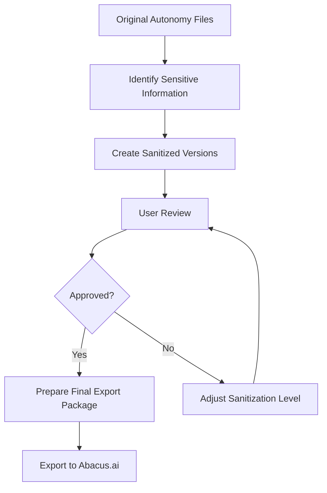

# Plan for Exporting Autonomy Files to Abacus.ai

## Overview

This document outlines the plan for exporting the autonomy framework files to Abacus.ai, with appropriate sanitization to remove sensitive information for sharing and review purposes.

## Files to Export

The autonomy folder contains 7 key framework files:
1. autonomous_decision_matrix.md
2. autonomy_enhancement_framework.md
3. legal_compliance_framework.md
4. notification_approval_system.md
5. preauthorized_accounts_framework.md
6. technical_infrastructure_framework.md
7. template_workflow_library.md

## Sensitive Information Identification

After reviewing these files, the following types of potentially sensitive information need to be sanitized:

**Financial Information:**
- Dollar amounts and spending thresholds
- Transaction limits
- Investment allocation percentages

**Authentication Information:**
- API key references
- OAuth token details
- Authentication methods
- Credential management systems

**Personal/Contact Information:**
- Contact hierarchies
- Escalation pathways
- Notification channels

**Technical Infrastructure Details:**
- Server specifications
- Database connection information
- Network configurations
- Security implementation details

**Account Information:**
- Platform-specific account details
- Payment processor information
- Cryptocurrency wallet references

## Sanitization Approach

The sanitization process will follow these guidelines:

1. **Replace Specific Values with Placeholders:**
   - Financial thresholds: Replace with `[AMOUNT_LIMIT]`, `[TRANSACTION_LIMIT]`, etc.
   - Percentages: Replace with `[PERCENTAGE]` or keep if they're standard industry practices
   - API/Authentication details: Replace with `[API_CREDENTIAL]`, `[AUTH_METHOD]`, etc.

2. **Generalize Sensitive Implementation Details:**
   - Replace specific technical implementations with general descriptions
   - Remove any proprietary or unique infrastructure details
   - Generalize security measures while maintaining the framework structure

3. **Maintain Framework Integrity:**
   - Preserve the overall structure and methodology of each framework
   - Keep the conceptual approaches and decision matrices intact
   - Ensure the sanitized versions still provide valuable insights without revealing sensitive details

## Export Process

### Phase 1: Create Sanitized Versions
- Create a new directory called "sanitized_autonomy" to store the sanitized files
- Process each file individually, applying the sanitization rules
- Maintain the same file names and structure for clarity

### Phase 2: Review Process
- Provide the sanitized files for review
- Collect feedback on whether the sanitization level is appropriate
- Make adjustments as needed

### Phase 3: Final Export
- Once sanitized versions are approved, prepare the final versions for Abacus.ai
- Create a README.md file explaining the framework collection
- Package the files in the format most suitable for Abacus.ai

## Documentation

Create a brief documentation file explaining:
- The purpose of each framework
- How the frameworks interconnect
- Implementation considerations for Abacus.ai agents
- Any special instructions for utilizing these frameworks in an agent context

## Process Flow

## Implementation Timeline

1. **Phase 1: Sanitization** (1-2 days)
   - Create sanitized versions of all 7 framework files
   - Develop documentation for the collection

2. **Phase 2: Review** (1 day)
   - Review sanitized files with stakeholders
   - Make necessary adjustments

3. **Phase 3: Final Export** (1 day)
   - Package final versions for Abacus.ai
   - Support the upload process as needed

## Next Steps

1. Create the "sanitized_autonomy" directory
2. Begin sanitization of the first framework file (autonomous_decision_matrix.md)
3. Establish a review process for sanitized files
4. Determine the preferred format for Abacus.ai upload