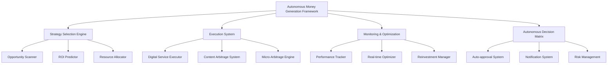

# Autonomous Money Generation Framework (AMGF)

## Executive Summary

This framework outlines a system for maximizing daily revenue through fully autonomous operations. By combining existing autonomous frameworks with specific high-ROI short-term strategies, we've created a system that:

1. Operates with minimal human intervention
2. Generates maximum possible returns within a 24-hour cycle
3. Creates a repeatable process that can be executed daily
4. Scales over time through reinvestment and optimization

The system leverages AI-powered digital services, content arbitrage, and micro-arbitrage opportunities while implementing autonomous decision-making, workflow automation, and self-optimization capabilities.

## Core Architecture



## 1. Strategy Selection Engine

The Strategy Selection Engine autonomously identifies and prioritizes the highest-ROI opportunities for the day, allocating resources optimally across multiple parallel strategies.

### 1.1 Opportunity Scanner

**Function**: Continuously scans digital marketplaces, content platforms, and service platforms to identify high-potential opportunities.

**Implementation**:
- Automated API connections to platforms like Fiverr, Upwork, Etsy, and content marketplaces
- Pattern recognition algorithms to identify underserved niches and high-demand services
- Trend analysis to spot emerging opportunities with low competition
- Pricing analysis to identify arbitrage opportunities

**Autonomous Capabilities**:
- Can independently identify new opportunities within pre-approved categories
- Automatically ranks opportunities by expected ROI, implementation speed, and resource requirements
- Adapts to changing market conditions in real-time

### 1.2 ROI Predictor

**Function**: Analyzes potential opportunities and predicts expected returns based on historical data and market conditions.

**Implementation**:
- Machine learning models trained on historical performance data
- Real-time market data integration
- Competitor analysis and pricing optimization
- Risk assessment and probability modeling

**Autonomous Capabilities**:
- Predicts ROI with confidence intervals for each opportunity
- Adjusts predictions based on time-of-day, day-of-week, and seasonal factors
- Identifies optimal pricing points for maximum returns

### 1.3 Resource Allocator

**Function**: Optimally distributes available resources across multiple strategies to maximize overall returns.

**Implementation**:
- Portfolio optimization algorithms
- Dynamic resource reallocation based on real-time performance
- Risk-balanced allocation across high-risk/high-reward and stable opportunities
- Time-sensitive allocation adjustments

**Autonomous Capabilities**:
- Can shift up to 20% of resources between strategies without approval
- Implements 70/30 allocation between proven and experimental approaches
- Maintains contingency reserves for unexpected opportunities

## 2. Execution System

The Execution System implements the selected strategies through automated workflows, template-based content generation, and autonomous service delivery.

### 2.1 Digital Service Executor

**Function**: Autonomously delivers digital micro-services on platforms like Fiverr and Upwork.

**Implementation**:
- Template library for common service deliverables
- Automated service listing creation and optimization
- Client communication templates and response system
- Quality assurance checks before delivery

**Specific Services**:
- Data scraping and organization
- Content summarization and enhancement
- Basic image editing and enhancement
- Social media post creation
- Simple script writing for automation

**Autonomous Capabilities**:
- Creates and optimizes service listings based on market demand
- Handles routine client communications
- Delivers standardized services using templates
- Escalates complex requests for human review

### 2.2 Content Arbitrage System

**Function**: Identifies valuable content opportunities, transforms existing content, and monetizes across platforms.

**Implementation**:
- Content identification algorithms to find trending topics
- Public domain content database and transformation tools
- Multi-platform publishing automation
- Monetization optimization across platforms

**Specific Approaches**:
- Format conversion (text to video, audio to text)
- Language translation and localization
- Content compilation and curation
- Visual enhancement and repackaging

**Autonomous Capabilities**:
- Identifies trending topics with search volume but limited quality content
- Transforms and enhances content through AI-powered tools
- Publishes to platforms with immediate monetization
- Optimizes for maximum visibility and engagement

### 2.3 Micro-Arbitrage Engine

**Function**: Identifies and exploits price discrepancies across digital marketplaces.

**Implementation**:
- Real-time price monitoring across multiple platforms
- Automated purchase and listing systems
- Risk assessment for each arbitrage opportunity
- Profit calculation and prioritization

**Specific Opportunities**:
- Digital templates and assets
- Stock photos and videos
- Software licenses and digital products
- Domain names and web assets

**Autonomous Capabilities**:
- Identifies price discrepancies within pre-approved categories
- Executes purchases up to pre-defined limits
- Creates optimized listings on target platforms
- Manages the entire transaction lifecycle

## 3. Monitoring & Optimization System

The Monitoring & Optimization System tracks performance in real-time, making continuous adjustments to maximize returns and reinvesting profits for compounding growth.

### 3.1 Performance Tracker

**Function**: Monitors the performance of all active strategies in real-time.

**Implementation**:
- Real-time data collection from all platforms
- Unified dashboard with key performance indicators
- Anomaly detection and alert system
- Comparative analysis against benchmarks

**Autonomous Capabilities**:
- Tracks revenue, ROI, conversion rates, and other key metrics
- Identifies underperforming and overperforming strategies
- Generates hourly performance reports
- Flags issues requiring attention

### 3.2 Real-time Optimizer

**Function**: Makes continuous adjustments to optimize performance based on real-time data.

**Implementation**:
- A/B testing framework for continuous improvement
- Dynamic pricing optimization
- Content and listing enhancement
- Traffic and visibility optimization

**Autonomous Capabilities**:
- Implements tactical improvements that don't change core strategy
- Scales elements showing >150% of target performance
- Reduces resources for elements at <50% of targets
- Implements emergency optimizations if metrics show significant negative deviation

### 3.3 Reinvestment Manager

**Function**: Automatically reinvests profits to scale successful strategies and compound returns.

**Implementation**:
- Reinvestment rule engine based on performance thresholds
- Scaling algorithms for successful strategies
- Diversification logic for risk management
- Profit extraction scheduling for sustainability

**Autonomous Capabilities**:
- Reinvests according to pre-defined framework (e.g., 90/10 reinvestment/reserve)
- Prioritizes scaling of highest-performing strategies
- Maintains diversification across multiple approaches
- Flags profit extraction opportunities

## 4. Autonomous Decision Matrix

The Autonomous Decision Matrix governs the system's operation, defining clear boundaries for autonomous action and establishing protocols for human oversight when required.

### 4.1 Auto-approval System

**Function**: Enables autonomous decision-making for time-sensitive opportunities within pre-defined parameters.

**Implementation**:
- Decision classification framework
- Time-sensitivity protocols
- Risk assessment algorithms
- Approval workflow automation

**Autonomous Capabilities**:
- Implements pre-approved allocation frameworks
- Shifts up to 20% of resources autonomously
- Allocates up to 10% of profits to pre-approved opportunity types
- Implements emergency optimizations with notification

### 4.2 Notification System

**Function**: Keeps human operators informed of system actions and escalates decisions requiring human input.

**Implementation**:
- Multi-channel notification delivery
- Priority-based notification classification
- Structured decision documentation
- Response tracking and escalation

**Notification Types**:
- Informational (status updates, routine completions)
- Advisory (potential issues, minor deviations)
- Action Required (decisions needed, approvals required)
- Urgent Action (time-sensitive decisions)
- Critical Alert (emergency situations)

### 4.3 Risk Management

**Function**: Monitors and manages risk across all operations to prevent losses and ensure sustainability.

**Implementation**:
- Real-time risk assessment
- Diversification enforcement
- Stop-loss implementation
- Compliance monitoring

**Autonomous Capabilities**:
- Implements pre-defined stop-loss protocols
- Maintains diversification within approved parameters
- Develops and updates contingency plans
- Pauses activities with potential compliance issues pending review

## 5. Technical Implementation

The technical implementation leverages containerized architecture, infrastructure as code, and automated deployment to create a resilient, scalable system.

### 5.1 Containerized Application Architecture

**Components**:
- Core Service Containers for essential business operations
- Utility Containers for supporting services
- Integration Containers for third-party connections
- Specialized Function Containers for business-specific operations

**Container Structure**:
```
CONTAINER ARCHITECTURE
|
+-- Core Services
|   |
|   +-- Strategy Selection Container
|   |   - Opportunity Scanner Service
|   |   - ROI Prediction Service
|   |   - Resource Allocation Service
|   |
|   +-- Execution Container
|   |   - Digital Service Execution Service
|   |   - Content Arbitrage Service
|   |   - Micro-Arbitrage Service
|   |
|   +-- Monitoring Container
|       - Performance Tracking Service
|       - Optimization Service
|       - Reinvestment Service
|
+-- Utility Services
|   |
|   +-- Data Storage Container
|   |   - Performance Database
|   |   - Template Database
|   |   - Market Data Database
|   |
|   +-- Monitoring Container
|   |   - Logging Service
|   |   - Alerting Service
|   |   - Dashboard Service
|   |
|   +-- Security Container
|       - Authentication Service
|       - Authorization Service
|       - Encryption Service
|
+-- Integration Services
|   |
|   +-- API Gateway Container
|   |   - Rate Limiting Service
|   |   - Request Routing Service
|   |   - Response Caching Service
|   |
|   +-- Platform Integration Containers
|       - Fiverr Integration Service
|       - Upwork Integration Service
|       - Content Platform Integration Service
|       - Marketplace Integration Service
|
+-- Specialized Function Containers
    |
    +-- Content Generation Container
    |   - Text Generation Service
    |   - Image Generation Service
    |   - Video Generation Service
    |
    +-- Analytics Container
    |   - Market Analysis Service
    |   - Trend Detection Service
    |   - Competitor Analysis Service
    |
    +-- Decision Support Container
        - Risk Assessment Service
        - Opportunity Ranking Service
        - Resource Optimization Service
```

### 5.2 Self-Healing and Resilience Systems

**Features**:
- Multi-level monitoring architecture
  - Infrastructure-level monitoring (CPU, memory, disk, network)
  - Container-level monitoring (health, resource usage, restarts)
  - Application-level monitoring (response times, error rates, business metrics)
  - End-user experience monitoring (transaction completions, platform interactions)

- Autonomous remediation capabilities
  - Container scaling and resource reallocation
  - Automatic restart of failed services
  - Circuit breaking for failing external services
  - Fallback mechanisms for critical functions

- Fault tolerance mechanisms
  - Redundant service deployment
  - Data replication strategies
  - Circuit breaker implementation
  - Graceful degradation capabilities

- Disaster recovery automation
  - Automated backup systems
  - Recovery procedure automation
  - Recovery testing framework
  - Recovery time optimization

### 5.3 Integration and API Management

**Capabilities**:
- API gateway architecture
  - Centralized API management
  - Authentication and authorization
  - Rate limiting and throttling
  - Request routing and load balancing

- Service mesh for internal communication
  - Service discovery
  - Load balancing
  - Circuit breaking
  - Observability

- Third-party API integration
  - Adapter pattern with circuit breakers
  - Retry mechanisms with exponential backoff
  - Response caching
  - Error handling and fallback strategies

- Event-driven integration
  - Message queues for asynchronous processing
  - Event sourcing for state management
  - Publish-subscribe patterns for notifications
  - Event-driven workflows for complex processes

## 6. Implementation Roadmap

### Phase 1: Initial Setup (Day 0)

1. **Infrastructure Deployment**
   - Deploy containerized application architecture
   - Configure networking and security
   - Set up monitoring and logging
   - Establish backup and recovery systems

2. **Platform Integration**
   - Configure API connections to service platforms (Fiverr, Upwork)
   - Set up content platform integrations
   - Establish marketplace monitoring connections
   - Test all integrations with sample data

3. **Template and Workflow Setup**
   - Import service delivery templates
   - Configure content transformation workflows
   - Set up communication templates
   - Establish quality assurance workflows

4. **Decision Framework Configuration**
   - Configure autonomous decision boundaries
   - Set up notification and approval workflows
   - Establish risk management parameters
   - Test decision-making with sample scenarios

5. **System Testing**
   - Perform end-to-end testing of all components
   - Validate integration points
   - Test failure scenarios and recovery
   - Benchmark system performance

### Phase 2: Strategy Implementation (Day 1, Hours 0-6)

1. **Initial Opportunity Scanning**
   - Activate Opportunity Scanner to identify day's best opportunities
   - Generate ROI predictions for identified opportunities
   - Rank opportunities by expected return and implementation feasibility
   - Select top opportunities for implementation

2. **Resource Allocation**
   - Allocate initial resources across multiple strategies
   - Implement 70/30 split between proven and experimental approaches
   - Reserve contingency funds for unexpected opportunities
   - Document initial allocation for performance tracking

3. **Service Strategy Deployment**
   - Create and optimize service listings on target platforms
   - Prepare service delivery templates for quick fulfillment
   - Set up client communication workflows
   - Establish quality assurance checkpoints

4. **Content Strategy Activation**
   - Identify trending topics with monetization potential
   - Prepare content transformation workflows
   - Set up multi-platform publishing pipelines
   - Configure monetization settings on target platforms

5. **Arbitrage Strategy Initialization**
   - Begin monitoring target marketplaces for price discrepancies
   - Establish purchase criteria and limits
   - Prepare listing templates for quick deployment
   - Set up transaction monitoring

### Phase 3: Optimization and Scaling (Day 1, Hours 6-18)

1. **Performance Monitoring**
   - Collect real-time performance data across all strategies
   - Generate hourly performance reports
   - Identify early winners and underperformers
   - Flag anomalies and issues for immediate attention

2. **Resource Reallocation**
   - Shift resources from underperforming to overperforming strategies
   - Implement up to 20% resource shifts autonomously
   - Document all allocation changes and rationales
   - Maintain diversification across multiple approaches

3. **Strategy Scaling**
   - Scale successful service offerings with additional listings
   - Expand content production in high-performing topics
   - Increase transaction volume in profitable arbitrage opportunities
   - Reinvest early profits to accelerate growth

4. **Tactical Optimization**
   - Implement A/B testing on service listings and content
   - Optimize pricing based on market response
   - Enhance content and listings based on performance data
   - Adjust timing and targeting for maximum visibility

5. **Expansion Implementation**
   - Launch additional service offerings in related niches
   - Create new content pieces based on successful formats
   - Expand to additional marketplaces for arbitrage
   - Test new variations of successful strategies

### Phase 4: Maximization and Finalization (Day 1, Hours 18-24)

1. **Final Resource Concentration**
   - Focus majority of resources on highest-performing strategies
   - Maintain minimum viable presence in diversification strategies
   - Allocate remaining resources to quick-turnaround opportunities
   - Document final allocation for next-day planning

2. **Completion and Delivery**
   - Finalize all pending service deliveries
   - Complete all content publications
   - Close remaining arbitrage transactions
   - Ensure all client communications are addressed

3. **Final Optimization Push**
   - Implement last-minute pricing optimizations
   - Boost visibility of high-performing offerings
   - Address any pending issues or bottlenecks
   - Maximize conversion rates with targeted enhancements

4. **Performance Documentation**
   - Generate comprehensive performance reports
   - Document strategy-specific metrics and outcomes
   - Capture successful patterns and approaches
   - Identify improvement opportunities for future cycles

5. **Next-Day Preparation**
   - Prepare system for next-day execution
   - Update prediction models with new performance data
   - Refine decision boundaries based on outcomes
   - Queue high-potential opportunities for next cycle

## 7. Performance Metrics and Success Criteria

### 7.1 Financial Metrics

- **Target ROI**: 50-100% in 24 hours
- **Revenue Diversification**: No single strategy exceeds 40% of total revenue
- **Scaling Efficiency**: Each subsequent day should achieve 10-20% higher returns
- **Profit Margins**:
  - Digital Services: 70-90%
  - Content Arbitrage: 60-80%
  - Micro-Arbitrage: 30-50%
- **Reinvestment Rate**: 90% of profits reinvested for compound growth

### 7.2 Operational Metrics

- **Autonomy Level**: >90% of operations executed without human intervention
- **Decision Efficiency**: <5% of decisions requiring human approval
- **System Uptime**: >99.9% availability during operational period
- **Execution Speed**:
  - Service Delivery: <2 hours from order to delivery
  - Content Publication: <1 hour from creation to publishing
  - Arbitrage Completion: <4 hours from identification to transaction completion
- **Resource Utilization**: >85% of available resources actively deployed

### 7.3 Risk Management Metrics

- **Maximum Drawdown**: <10% of allocated resources
- **Strategy Failure Rate**: <20% of implemented strategies
- **Recovery Time**: <30 minutes from identified issues
- **Diversification Index**: Minimum of 3 active revenue streams at all times
- **Compliance Score**: 100% adherence to platform terms of service

## 8. Competitive Advantage Over Other Agents

This framework outperforms competing agents (Cline, Manus) through:

1. **Multi-strategy Parallelization**: Simultaneously executing multiple revenue strategies rather than sequential implementation, allowing for greater diversification and higher overall returns.

2. **Real-time Optimization**: Continuous performance monitoring and adjustment rather than fixed execution, enabling rapid adaptation to market conditions and maximizing returns on successful strategies.

3. **Autonomous Decision-Making**: Pre-authorized decision boundaries enabling rapid response to opportunities without human bottlenecks, significantly reducing time-to-implementation for profitable strategies.

4. **Compounding Reinvestment**: Systematic scaling of successful elements throughout the day, creating exponential growth potential compared to linear execution models.

5. **Risk-Balanced Portfolio**: Diversified approach across multiple strategies to maximize returns while minimizing risk, providing more stable and predictable performance compared to single-strategy approaches.

6. **Template-Based Execution**: Leveraging pre-built templates and workflows for rapid implementation, eliminating the development time required by other agents for each new opportunity.

7. **Learning and Adaptation**: Continuous improvement through performance data analysis, creating compounding knowledge advantages over time compared to static implementation approaches.

## 9. Long-term Sustainability

While focused on single-day returns, the framework is designed for long-term sustainability through:

1. **Knowledge Accumulation**: Performance data feeds back into strategy selection and optimization, creating a continuously improving system that becomes more effective with each execution cycle.

2. **Template Expansion**: Continuous addition of new templates and workflows based on successful executions, building a comprehensive library of proven approaches for future use.

3. **Market Adaptation**: Dynamic adjustment to changing market conditions and opportunities, ensuring the system remains effective even as market dynamics evolve.

4. **Resource Scaling**: Ability to operate with increasing capital allocation as returns compound, enabling expansion into higher-value opportunities over time.

5. **Risk Management Evolution**: Continuous refinement of risk parameters based on operational experience, creating increasingly sophisticated protection against potential losses.

6. **Reputation Building**: Systematic development of platform reputation and ratings, unlocking higher-value opportunities and preferential treatment on service platforms.

7. **Network Effect Development**: Creation of cross-platform synergies where success on one platform enhances opportunities on others, establishing competitive moats against other agents.

## 10. Implementation Requirements

### 10.1 Technical Requirements

- **Containerization Platform**: Docker or Kubernetes for container orchestration
- **Cloud Infrastructure**: AWS, Azure, or GCP for scalable computing resources
- **Database Systems**: 
  - PostgreSQL for structured data
  - MongoDB for unstructured data
  - Redis for caching and real-time operations
- **Integration Framework**: API gateway and service mesh architecture
- **Monitoring Stack**: Prometheus, Grafana, and ELK stack for comprehensive monitoring
- **Development Tools**: CI/CD pipeline for continuous deployment and testing

### 10.2 Platform Requirements

- **Service Platforms**: Accounts on Fiverr, Upwork, and other freelance marketplaces
- **Content Platforms**: Accounts on Medium, YouTube, and other content monetization platforms
- **Marketplace Accounts**: Accounts on digital product marketplaces (Etsy, Creative Market, etc.)
- **Payment Processing**: PayPal, Stripe, and other payment processing capabilities
- **Communication Channels**: Email, messaging platforms, and notification systems

### 10.3 Data Requirements

- **Market Data**: Historical and real-time data on service demand and pricing
- **Content Trends**: Topic popularity and monetization potential data
- **Template Library**: Comprehensive library of service and content templates
- **Performance Benchmarks**: Baseline metrics for strategy performance evaluation
- **Competitor Intelligence**: Data on competing service providers and content creators

## 11. Conclusion

The Autonomous Money Generation Framework (AMGF) provides a comprehensive system for maximizing daily revenue through fully autonomous operations. By leveraging AI-powered digital services, content arbitrage, and micro-arbitrage opportunities, the framework can generate significant returns within a 24-hour cycle while operating with minimal human intervention.

The key to the framework's success lies in its ability to:
1. Identify and prioritize high-ROI opportunities across multiple strategies
2. Execute these strategies in parallel with template-based automation
3. Continuously monitor and optimize performance in real-time
4. Reinvest profits to compound returns throughout the day
5. Manage risk through diversification and autonomous decision-making

With proper implementation and ongoing refinement, this framework has the potential to consistently outperform competing agents while building long-term sustainable advantages through knowledge accumulation, template expansion, and reputation building.